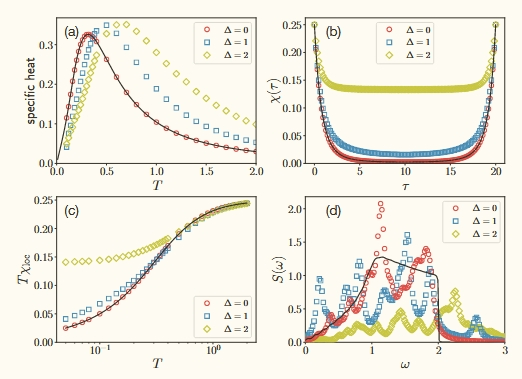
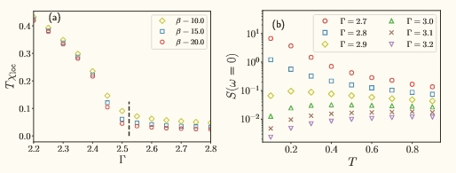

# CMPO For Finite Temperature
 
I try to reproduce the results of the paper [Tang W, Tu H H, Wang L. Continuous matrix product operator approach to finite temperature quantum states[J]. Physical Review Letters, 2020, 125(17): 170604](https://journals.aps.org/prl/abstract/10.1103/PhysRevLett.125.170604) in Julia.

